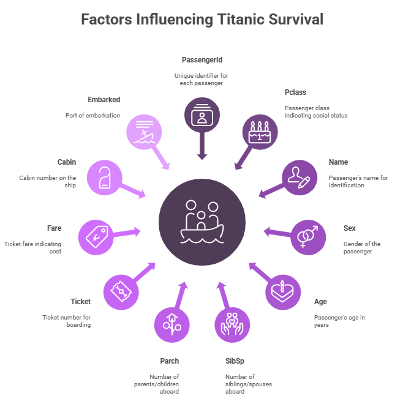

# **Titanic Survival Prediction**
## CODSOFT Internship Project

## Overview
This project is a Machine Learning classification task to predict whether a passenger survived the Titanic disaster using historical data. The dataset used is the classic Titanic dataset, often considered a beginner-level dataset for supervised learning and data science projects.
Objective: Build a predictive model using features such as age, sex, ticket fare, class, etc., to determine the likelihood of survival.

## Project Structure
Titanic_CODSOFT/
│
├── Titanic_CODSOFT.ipynb     # Main notebook with all code and analysis
├── README.md                 # Project documentation
├── requirements.txt          # Required dependencies (optional)
└── dataset/                  

## Dataset Description
| Feature       | Description                                                          |
| ------------- | -------------------------------------------------------------------- |
| `PassengerId` | Unique ID for each passenger                                         |
| `Pclass`      | Passenger class (1 = 1st, 2 = 2nd, 3 = 3rd)                          |
| `Name`        | Name of passenger                                                    |
| `Sex`         | Gender of passenger                                                  |
| `Age`         | Age in years                                                         |
| `SibSp`       | Number of siblings/spouses aboard                                    |
| `Parch`       | Number of parents/children aboard                                    |
| `Ticket`      | Ticket number                                                        |
| `Fare`        | Ticket fare                                                          |
| `Cabin`       | Cabin number (many missing values)                                   |
| `Embarked`    | Port of Embarkation (C = Cherbourg, Q = Queenstown, S = Southampton) |
| `Survived`    | Survival status (0 = No, 1 = Yes - target variable)                  |

## Features affecting Survival Rates of Paseengers

## Methodology
Flowchart of major steps:

1. Data Loading
Used pandas to load the dataset (train.csv) into a DataFrame.

2. Exploratory Data Analysis (EDA)
Analyzed distribution of target variable.
Visualized survival rates based on gender, passenger class, and embarked location using seaborn.
Handled missing values (Age, Embarked, etc.).

3. Data Cleaning & Preprocessing
Filled missing Age with median.
Dropped less useful or high-missing-value columns like Cabin and Ticket.
Converted categorical variables (Sex, Embarked) using label encoding or one-hot encoding.
Normalized continuous features. (if needed)

4. Feature Selection
Selected relevant features for the model: Pclass, Sex, Age, SibSp, Parch, Fare, Embarked.

5. Model Building
Applied classification models using scikit-learn:
Random Forest Classifier

6. Model Evaluation
Split data using train_test_split.
Evaluated models using:
Accuracy Score
Confusion Matrix
Classification Report

## Files Relation

## Dependencies
pip install pandas numpy matplotlib seaborn scikit-learn
or 
pip install -r requirements.txt

## Run the model
1. Clone the repository or download the notebook.
2. Make sure you have Jupyter Notebook installed, or open it in Google Colab.
3. Run all cells in Titanic_CODSOFT.ipynb sequentially

UI Dashboard Screenshot: https://1drv.ms/i/c/0dc8d4ddd66f20c7/ERux01ZB7m9Fj80xxtEcYJYB4Rk1VBRfneDVRCfLV9F2PA?e=QJ78DD

## Author
Vijayan Naidu 
MSc Data Science, Fergusson College, Pune

